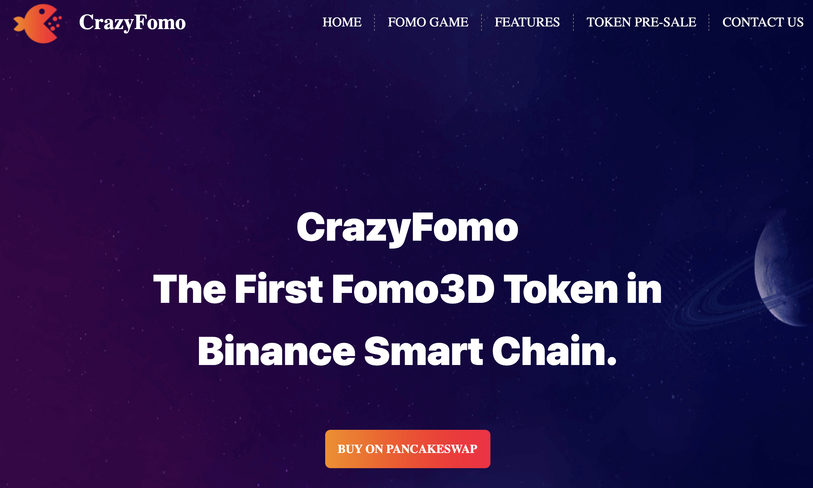

# CrazyFomo

> The First Fomo3D Token in Binance Smart Chain.

**CFO**，aka Crazyfomo, first visual fomo game on Binance Smart Chain. Unbeatable Eco-mechanism ever!
CFO team did tons of research in fomo gaming, discussing with MIT scholar, come to a final mechanism after 4 months.

## Game Rules

- 5% of each transaction goes into fomo rewarding pool, Fomo3d games’ Initial period is 4 hours, one transaction completed, 30s added, 8 hours top. 

- The last contributer will be rewarded with 20% of the rewarding pool, 
  50% of the rewarding pool will be allocated to the last 6 transaction contributers (including the very last one), based on the share of each transaction.

- Last 30% rewarding will be added to next round. Thus, the pool will always be fill-up, there will always be players.

- The mechanism set the initial transaction on 10000 CFO tokens minimum, the 2ed one is 10003.5 CFO tokens, in this way, it takes at least 330000 CFO tokens to join the game when we come to 10000th transaction.

## Transaction Fees

- **3% LOTTERY FUNCTION**

  3% of every transaction is randomly sent to 1 holder.

- **4% TAX FEE (REFLECTIONS)**

  4% of every transaction is redistributed to all holders based on how much CrazyFomo they hold.

- **2% AUTO LP**

  2% is automatically put into a Liquidity pair on PancakeSwap Half is traded to BNB, half is held as CrazyFomo.

- **5% FOMO3D AWARD**

  5% Fomo3d Pool is a decentralized, trustless lottery game, in which the last 6 person to buy keys at the end of a round wins the pot!

## Social Profiles

- Web：https://crazyfomo.com/#/fomoGame
- Twitter：https://twitter.com/crazyfomo?s=21
- Telegram：https://t.me/CrazyFOMO
